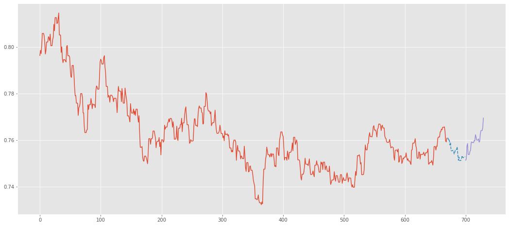
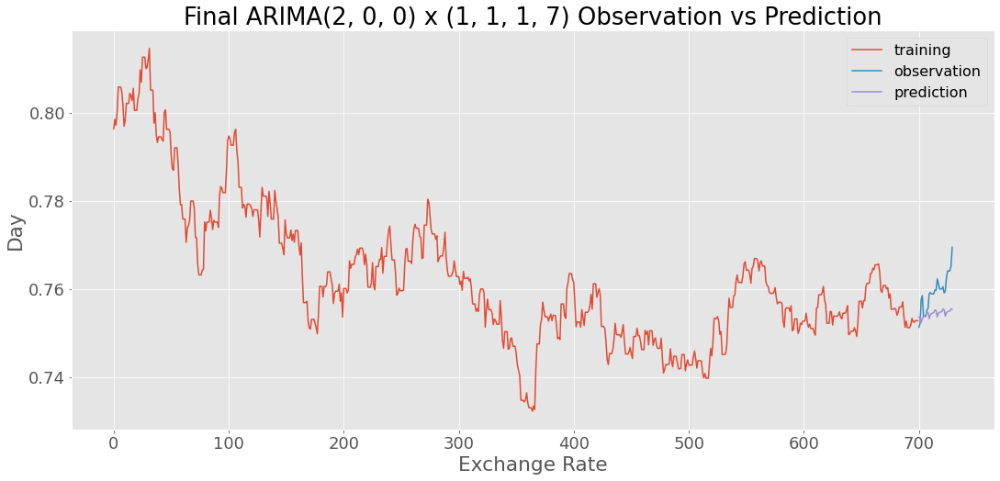
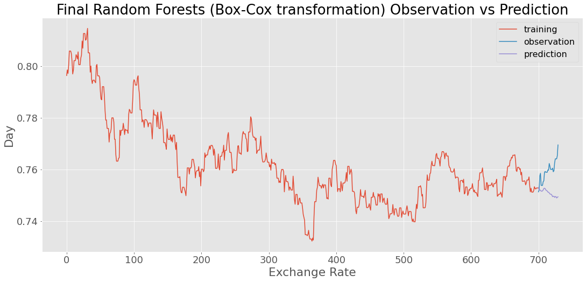

CAD to USD exchange rate prediction
================
Fanli Zhou
2020/6/20

-   [Summary](#summary)
-   [Methods](#methods)
    -   [Data](#data)
    -   [Analysis Methods](#analysis-methods)
-   [Results and Discussion](#results-and-discussion)
    -   [Data Visualization](#data-visualization)
    -   [Feature Engineering and Model
        Training](#feature-engineering-and-model-training)
    -   [Models Evaluation](#models-evaluation)
    -   [Conclusions](#conclusions)
-   [Limitations](#limitations)
-   [References](#references)

Summary
=======

In this project, I attempted to predict CAD to USD exchange rates in 30
days given previous exchange rates. This project is mainly for me to
practice analyzing time series data and applying machine learning
methods on those data. Through this project, I realized how difficult it
is to make prediction in practice and feature engineering has great
potentials in improving predictions. If time allows, I would like to try
more machine learning methods and try more feature engineering methods.

Methods
=======

Data
----

The CAD to USD exchange rates data used in this project are obtained
using the [Alpha Vantage
API](https://www.alphavantage.co/documentation/). The data include daily
CAD to USD exchange rates from 2018-01-01 to 2019-12-31. Only daily
close data are used for this project. Data were imputated with last
observation carried over imputation to fill any gaps.

Analysis Methods
----------------

ARIMA models, classic supervised learning models, and LSTM models were
used to predict CAD to USD exchange rates in 30 days given previous
exchange rates. The Python programming language (Van Rossum and Drake
2009), the R programming language (R Core Team 2019) and the following
Python/R packages were used: pandas (McKinney 2010), Numpy (Oliphant
2006), Scipy (McKinney 2010), Scikit-learn (Pedregosa et al. 2011),
Matplotlib (Hunter 2007), Statsmodels (Seabold and Perktold 2010), Keras
(Chollet and others 2015), Tensorflow (Abadi et al. 2016), pmdarima
(Smith and others, n.d.), tqdm (Costa-Luis 2019), LightGBM (Ke et al.
2017), requests (Chandra and Varanasi 2015), knitr (Xie 2014), tidyverse
(Wickham 2017), rjson (Couture-Beil 2018). The code used to perform the
analysis and create this report can be found here:
<a href="https://github.com/flizhou/CAD_USD_exchange_rate_predictor" class="uri">https://github.com/flizhou/CAD_USD_exchange_rate_predictor</a>.

Results and Discussion
======================

The detailed analysis is in [`eda.ipynb`](../scripts/eda.ipynb).
Cumstomized functions are in [`functions.py`](../scripts/functions.py)

### Data Visualization

The time series is first split into train (670 observations), valid (30
observations) and test (30 observations) datasets.

### Feature Engineering and Model Training

To better analyse the time series, I included lagged features, which
include data in previous dates, in the analysis. To evaluate models, I
calculate the `Mean Absolute Percentage Error` (`MAPE`), the
`Root Mean Squared Error` (`RMSE`), and the `Min-Max Error` between
predictions and observations.

1.  `ARIMA` Forecast

I tried `ARIMA` by hand, `auto-ARIMA` and `auto-SARIMA` to find the best
`ARIMA` model. The best model is a `ARIMA(2, 0, 0) x (0, 1, 1, 7)`
model.

Figure 2. `ARIMA(2, 0, 0) x (0, 1, 1, 7)` Forcast.

1.  Classic Supervised Learning Forecast

The time series is not stationary. A stationary time series should have
constant mean and variance. So I removed the trend with differencing to
stabilize the mean and used log or Box-Cox transformation to stabilize
the variance. I tried `Random Forests`, `k-nearest neighbors` (`KNN`),
`Gradient Boosting Regressor`, `Light GBM Regressor` models.
Cross-validation was used to optimize `lag` and model hyperparameters.
The best model is a `Random Forests` model with Box-Cox transformation
of the data. The model achieved best performace with 12 lag features and
the hyperparameter, `n_estimators`, set to 100.

Figure 3. `Random Forests` (Box-Cox transformation) Forcast.

1.  `LSTM` Recurrent Neural Network Forecast

To train `LSTM` models, data were first transformed with `MinMAxScaler`
and ross-validation was used to optimize `lag`. The final `LSTM` uses
seven lags.

Figure 4. `LSTM` Forcast.

### Models Evaluation

Among the three final models, the `ARIMA(2, 0, 0) x (0, 1, 1, 7)` model
achieved the best scores.

|                                               |   MAPE |   RMSE | Min.Max.Error |
|:----------------------------------------------|-------:|-------:|--------------:|
| ARIMA(2, 0, 0) x (0, 1, 1, 7)                 | 0.0067 | 0.0061 |        0.0067 |
| Final Random Forests (Box-Cox transformation) | 0.0111 | 0.0097 |        0.0111 |
| Final LSTM                                    | 0.0170 | 0.0145 |        0.0170 |

Conclusions
-----------

In this analysis, I attempted to predict CAD to USD exchange rate in 30
days and my final best model is an `ARIMA(2, 0, 0) x (0, 1, 1, 7)`
model.

Limitations
===========

Models were only tested on the given test dataset and may not give good
predictions on new data. Besides, those models may not work well if new
external factors begin to affect the exchange rate. In this projectI
only tried lag features for feature engineering. There are great
potentials in feature engineering. If time allows, I could try other
feature engineering options such as rolling windows, time stamps and
external features.

References
==========

Abadi, Martı́n, Paul Barham, Jianmin Chen, Zhifeng Chen, Andy Davis,
Jeffrey Dean, Matthieu Devin, et al. 2016. “Tensorflow: A System for
Large-Scale Machine Learning.” In *12th
Usenix
Symposium on Operating Systems Design and Implementation
(Osdi
16)*, 265–83.

Chandra, Rakesh Vidya, and Bala Subrahmanyam Varanasi. 2015. *Python
Requests Essentials*. Packt Publishing Ltd.

Chollet, Francois, and others. 2015. “Keras.” GitHub. 2015.
<https://github.com/fchollet/keras>.

Costa-Luis, Casper O. da. 2019. “‘Tqdm‘: A Fast, Extensible Progress
Meter for Python and Cli.” *Journal of Open Source Software* 4 (37):
1277. <https://doi.org/10.21105/joss.01277>.

Couture-Beil, Alex. 2018. *Rjson: JSON for R*.
<https://CRAN.R-project.org/package=rjson>.

Hunter, J. D. 2007. “Matplotlib: A 2D Graphics Environment.” *Computing
in Science & Engineering* 9 (3): 90–95.
<https://doi.org/10.1109/MCSE.2007.55>.

Ke, Guolin, Qi Meng, Thomas Finley, Taifeng Wang, Wei Chen, Weidong Ma,
Qiwei Ye, and Tie-Yan Liu. 2017. “LightGBM: A Highly Efficient Gradient
Boosting Decision Tree.” In *NIPS*.

McKinney, Wes. 2010. “Data Structures for Statistical Computing in
Python.” In *Proceedings of the 9th Python in Science Conference*,
edited by Stéfan van der Walt and Jarrod Millman, 51–56.

Oliphant, Travis E. 2006. *A Guide to Numpy*. Vol. 1. Trelgol Publishing
USA.

Pedregosa, Fabian, Gaël Varoquaux, Alexandre Gramfort, Vincent Michel,
Bertrand Thirion, Olivier Grisel, Mathieu Blondel, et al. 2011.
“Scikit-Learn: Machine Learning in Python.” *Journal of Machine Learning
Research* 12 (Oct): 2825–30.

R Core Team. 2019. *R: A Language and Environment for Statistical
Computing*. Vienna, Austria: R Foundation for Statistical Computing.
<https://www.R-project.org/>.

Seabold, Skipper, and Josef Perktold. 2010. “Statsmodels: Econometric
and Statistical Modeling with Python.” In *9th Python in Science
Conference*.

Smith, Taylor G., and others. n.d. “pmdarima: ARIMA Estimators for
Python.” <http://www.alkaline-ml.com/pmdarima>.

Van Rossum, Guido, and Fred L. Drake. 2009. *Python 3 Reference Manual*.
Scotts Valley, CA: CreateSpace.

Wickham, Hadley. 2017. *Tidyverse: Easily Install and Load the
’Tidyverse’*. <https://CRAN.R-project.org/package=tidyverse>.

Xie, Yihui. 2014. “Knitr: A Comprehensive Tool for Reproducible Research
in R.” In *Implementing Reproducible Computational Research*, edited by
Victoria Stodden, Friedrich Leisch, and Roger D. Peng. Chapman;
Hall/CRC. <http://www.crcpress.com/product/isbn/9781466561595>.

